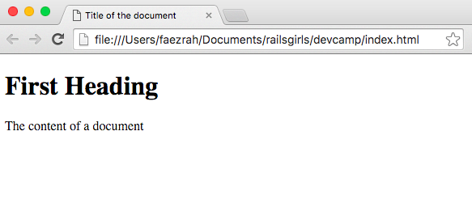
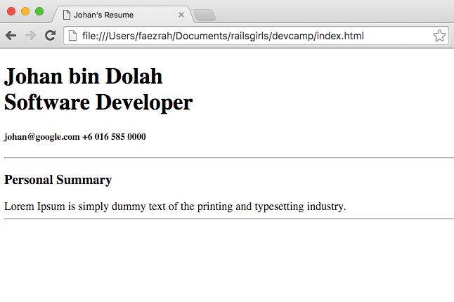
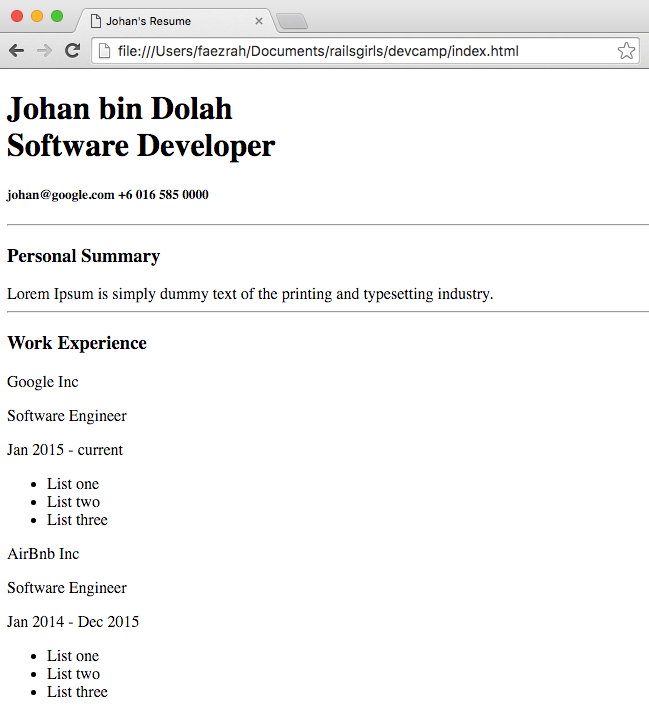
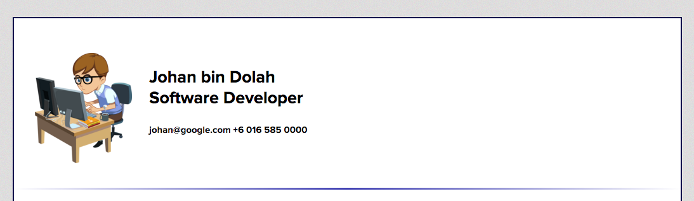
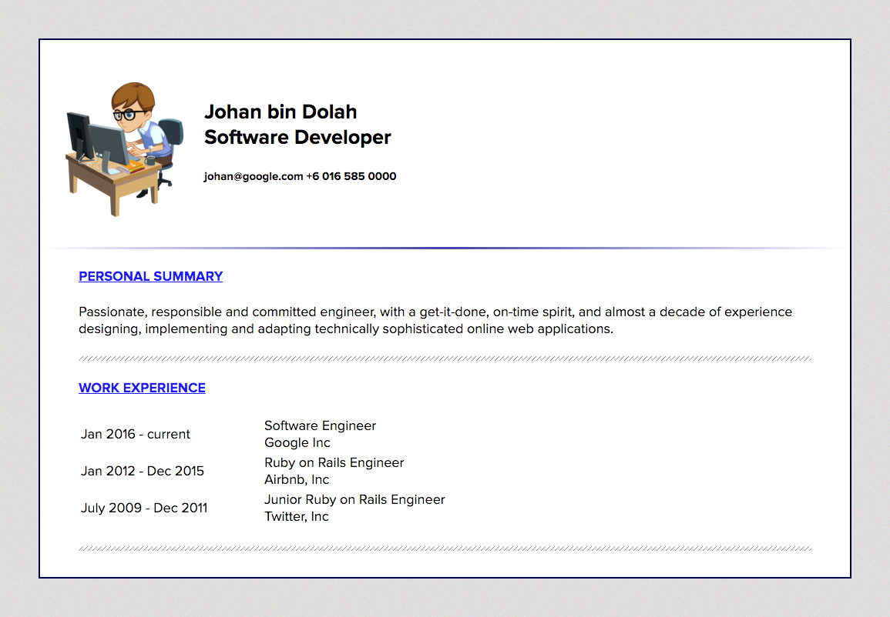
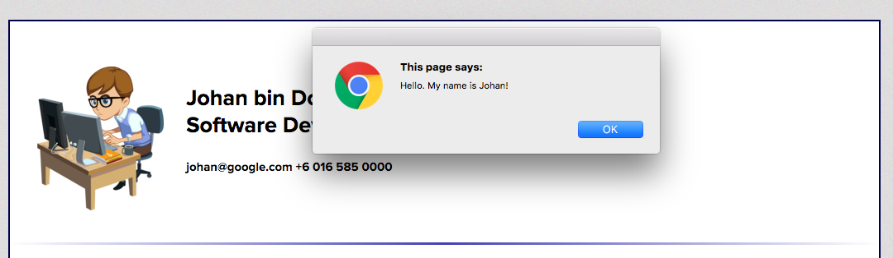

#### Introduction

Download `gdg-devcamp-exercise` folder from: https://github.com/railsgirlskl/gdg-devcamp-exercise

Open `gdg-devcamp-exercise` folder in `SublimeText`.

#### HTML

So, let's define the basic structure of the website in `index.html`.

```
<!DOCTYPE html>
<html>
	<head>
		<title>Title of the document</title>
	</head>
	<body>
		<h1>First Heading</h1>
		<p>The content of a document</p>
	</body>
</html>
```

> Tip: Save your code after every step.

Open `index.html` with the browser of your choice. (We prefer Chrome :laughing:)

It should look something like this:



**Mentor: Talk about HTML heading and paragraph tags.**

Below `<body>`, replace:

```
<h1>First Heading</h1>
<p>The content of a document</p>
```

With:

```
<section>
	<h2>Johan bin Dolah <br/>
	<span>Software Developer</span>
	</h2>
	<h5>
		<span>johan@google.com</span>
		<span>+6 016 585 0000</span>
	</h5>
</section>
<hr>

<section>
	<h4>Personal Summary</h4>
	Passionate, responsible and committed engineer, with a get-it-done, on-time spirit, and almost a decade of experience designing, implementing and adapting technically sophisticated online web applications.
</section>
<hr>
```

> Tip: It is always a good idea to type the code, rather than just copy and paste.

You can go ahead and replace the name and details to yours. After all, it is your resume. :innocent:

Save it and preview it on the browser.

It should now look something like the snapshot below:



After the last line, `<hr>`, continue adding more information:

```
<section>
	<h4>Work Experience</h4>
	<table>
		<tr>
			<td>Jan 2016 - current</td>
			<td>
				Software Engineer<br/>
				Google Inc
			</td>
		</tr>
		<tr>
			<td>Jan 2012 - Dec 2015</td>
			<td>
				Ruby on Rails Engineer<br/>
				Airbnb, Inc
			</td>
		</tr>
		<tr>
			<td>July 2009 - Dec 2011</td>
			<td>
				Ruby on Rails Engineer<br/>
				Twitter, Inc
			</td>
		</tr>
	</table>
	<hr>
</section>
```

When you're done, don't forget to save your work and refresh your browser.

The page should look like this:



You now have a basic resume page. But, the page doesn't look very nice yet. Let's do something about that.

We will style the page in a bit, but first - let's talk about CSS.

**Mentor: Talk a little about CSS.**

#### CSS

In Sublime Text, create a new file: `style.css`.

Then, open `index.html`, and below the line:

```
<title>Johan's Resume</title>
```

Add:

```
<link rel='stylesheet' type='text/css' href='style.css'>
```

The `<link>` tag defines a link between a document and an external resource. In this case, we are telling the browser that we want to link to an external style sheet.

Open `style.css`, write the code below:

```
body {
	padding: 0;
	margin: 0;
}
```

This will reset the default styling of the page to ensure consistency across different browsers.

Add this code in `body` to change the default font-family to:

```
font-family: 'Proxima Nova', sans-serif;
```

Save file and refresh the browser. You should see a slight change on your resume page.

What if you want to add a background image to your page? Easy! In `style.css`, in `body`, add:

```
background-image: url(images/bg.jpg);
```

You can also change the background image to your liking.

Now, let's add a container to allow for more sophisticated CSS styling.

```
#container {
	min-width: 600px;
	background: #ffffff;
	border: 2px solid #00004d;
	margin: 50px;
	padding-top: 25px;
	padding-bottom: 25px;
}
```

Then, in `resume.html`, after `<body>`, write this code:

```
<div id='container'>
```

> Tip: Having a container allows you to have more flexibility of styling your entire content. THe HTML body tag which serves as your background, and the div with an id of container which contains your content.

Dont forget to close the container section tag, so add `</div>` before `</body>`.

Save and refresh your browser to see changes.

**Mentor: Explain the difference between 'ID' and 'Class'.**

Now, after this line:

```
<div id='container'>
```

Replace `<section>`, with:

```
<section class='personal-details'>
```

While we are at it, how about we add our profile photo?

Add this code below `personal-details` section class:

```
<section class='photo'>
	
</section>
```

Open `style.css`, and write this code:

```
.personal-details {
  height: 200px;
  margin-top: 25px;
  padding: 5px;
}

.photo {
  float: left;
  width: 20%;
}

.display {
  height: 175px;
  display: block;
  margin-left: auto;
  margin-right: auto;
}
```

Feel free to change the profile image to suit you and don't forget to save your work.

Before we complete this section, let's quickly style the `<hr>`.

In `style.css`, add this code after `display`:

```
hr.right-gradient {
	border: 0;
	height: 3px;
	background-image: linear-gradient(to right, rgba(0, 0, 0, 0), rgba(0, 0, 153, 0.75), rgba(0, 0, 0, 0));
}
```

And then, in `index.html`, replace `hr` with:

```
<hr class='right-gradient'>
```

This will style our first horizontal line, like so:



So, how is it going so far? If you look at your resume, it should look better now, just slightly off.

Let's move on to style the personal summary section.

Replace `<section>`, with:

```
<section class='personal-summary'>
```

In `style.css`, write:

```
.personal-summary {
	margin-left: 50px;
	margin-right: 50px;
}
```

This will give our `personal-summary` section a margin left and right. 

Now, how about we give our sub-heading and horizontal line some styling as well?

Put the following in `style.css`:

```
h4 {
	text-transform: uppercase;
	text-decoration: underline;
	color: #1a1aff;
}

hr.hr-line {
	height: 6px;
	background: url(images/hr-line.png) repeat-x 0 0;
	border: 0;
	margin-top: 25px;
}
```

Then in `personal-summary` section, replace `hr` with:

```
<hr class='hr-line'>
```

Cool! We're almost there! Keep up the good work. :muscle:

Write these code in `style.css`:

```
.work-experience {
	margin-left: 50px;
	margin-right: 50px;
}

.work-details {
	width: 100%;
}

.work-year {
	width: 25%;
}
```

Then, open `index.html`, make sure your work-experience section code looks like this:

```
<section class='work-experience'>
	<h4>Work Experience</h4>
	<table class='work-details'>
		<tr>
			<td class='work-year'>Jan 2016 - current </td>
			<td>
				Software Engineer<br/>
				Google Inc
			</td>
		</tr>
		<tr>
			<td class='work-year'>Jan 2012 - Dec 2015</td>
			<td>
				Ruby on Rails Engineer<br/>
				Airbnb, Inc
			</td>
		</tr>
		<tr>
			<td class='work-year'>July 2009 - Dec 2011</td>
			<td>
				Junior Ruby on Rails Engineer<br/>
				Twitter, Inc
			</td>
		</tr>
	</table>
	<hr class='hr-line'>
</section>
```

If everything looks right, then you should have your resume looks something like this:



Let's take a break before we continue. :smile:

At this point, you deserve :coffee: :cake: !

**Mentor: Talk a little about Javascript.**

#### Javacript:

In `index.html`, add this code before `</head>`.

```
<script type = "text/javascript" src = "http://ajax.googleapis.com/ajax/libs/jquery/2.1.3/jquery.min.js"></script>
<script type = "text/javascript" src = "https://ajax.googleapis.com/ajax/libs/jqueryui/1.11.3/jquery-ui.min.js"></script>
```

Still in `index.html`, inside the body tag, edit the `` tag and add `onclick="alert('Hello! My name is Johan.')"`. 

Your `` tag will now look like this:

```

```

 > Tip: Single quotes can be used when two sets of double quotes are used close to each other to help avoid confusion.

Save your change and refresh the browser. Click on your picture, and you will get a prompt like so:



Now, before we continue, let's remove the onclick code from `` as we don't need it anymore.

Create a new file called `script.js`. All your script code will be written inside `script.js`.

In `index.html`, and just before the `</head>`, add this line:

```
<script type='text/javascript' src='script.js'></script>
```

Add this code:

```
$(document).ready(function() {

});
```

The `ready()` function is always used first to ensure the script doesn't run until the page is ready.

Let's try to make the profile image move when the image is clicked. To do that, we need to use the `effect()` function in the jQuery library.

Inside the ready function, write the code below:

```
$('.display').click(function(e){
	$(this).effect('shake');
	e.stopPropagation();
});
```

> Tip:  jQuery is a JavaScript library that makes it easier to use JavaScript.
A library in programming is a set of functions or functionality that lets us take a shortcut when writing our own code.

For shake effect to work, open `index.html` and replace:

```

```

With:

```

```

Save your file and refresh the browser. Go and click your profile picture:

You can always improve your code and change the shake effect to suit you:

Head over to this page to learn more about `shake` effect in jQuery: https://api.jqueryui.com/shake-effect/

### What Next?
- Improve your resume layout
- Add social buttons

### Additional Guides
- [Add design using Bootstrap](http://www.w3schools.com/bootstrap/bootstrap_get_started.asp)
