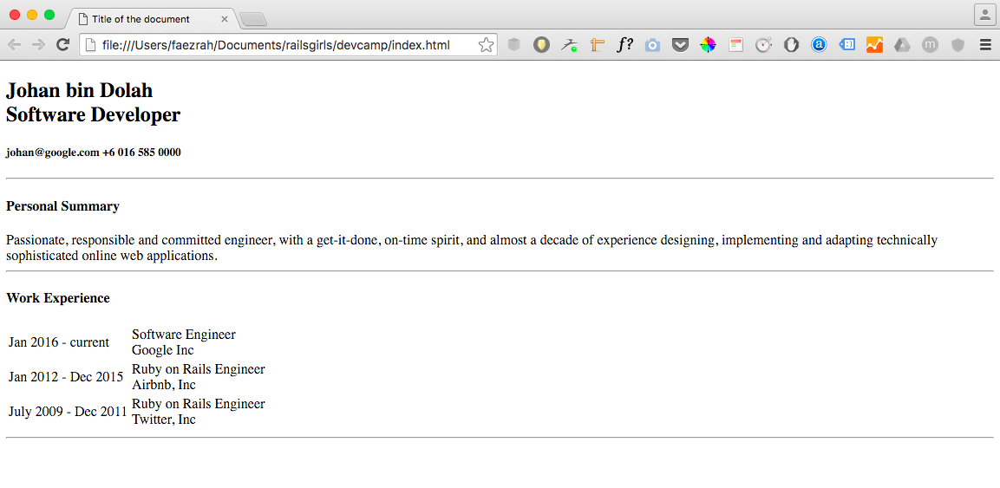

#### Introduction

Open `SublimeText`.
Create a `devcamp` folder. 
Create a new html file: `index.html`.

#### HTML

So, let's define the basic structure of the website.

```
<!DOCTYPE html>
<html>
	<head>
		<title>Title of the document</title>
	</head>
	<body>
		The content of a document
	</body>
</html>
```

> Tip: Save your code after every step.

Open `index.html` with the browser of your choice. (We prefer Chrome :laughing:)

It should look something like this:


Below `<body>`, and make sure before the closing tag `</body>`, write:

```
<h1>Johan bin Dolah <br/>
<span>Software Developer</span>
</h1>
<h5>
	<span>johan@google.com</span>
	<span>+6 016 585 0000</span>
</h5>
<hr>

<h3>Personal Summary</h3>
	Lorem Ipsum is simply dummy text of the printing and typesetting industry.
<hr>
```

You can go ahead and replace the name and details to yours. After all, it is your resume. :innocent:

Save it and preview it on the browser.

It should now look something like the snapshot below:


After the last line, `<hr>`, continue adding more information:

```
<h3>Work Experience</h3>
<p>Google Inc</p>
<p>Software Engineer</p>
<p>Jan 2016 - current</p>
<ul>
	<li>List one</li>
	<li>List two</li>
	<li>List three</li>
</ul>
<p>Airbnb, Inc</p>
<p>Ruby on Rails Engineer</p>
<p>Jan 2012 - Dec 2015</p>
<ul>
	<li>List one</li>
	<li>List two</li>
	<li>List three</li>
</ul>
```

When you're done, don't forget to save your work and refresh your browser.

The page should look like this:



You now have a basic resume page. But, the page doesn't look very nice yet. Let's do something about that.

We will style the page in a bit, but first - let's talk about CSS.

**Mentor: Talk a little about CSS.**

#### CSS

In Sublime Text, create a new file: `style.css`.

Then, open `index.html`, and below the line:

```
<title>Johan's Resume</title>
```

Add:

```
<link rel='stylesheet' type='text/css' href='style.css'>
```

Open `style.css`, write the code below:

```
body {
	padding: 0;
	margin: 0;
}
```

This will reset the default styling of the page to ensure consistency across different browsers.

Add this code in `body` to change the default font-family to:

```
font-family: 'Proxima Nova', sans-serif;
```

Save file and refresh the browser. You should see a slight change on your resume page.

What if you want to add a background image to your page? Easy! In `style.css`, in `body`, add:

```
background-image: url(../devcamp/images/bg.jpg);
```

Now, let's add a container to allow for more sophisticated CSS styling.

```
#container {
  min-width: 600px;
  background: #ffffff;
  border: 2px solid #00004d;
  margin: 50px;
  padding-top: 25px;
  padding-bottom: 25px;
}
```

Then, in `resume.html`, after `<body>`, write this code:

```
<section id='container'>
```

Dont forget to close the container section tag, so add `</section>` before `</body>`.

Save and refresh your browser to see changes.

**Mentor: Explain the difference between id and class.**

How about we style the personal summary section? Or is it time for :coffee:? :sunglasses:


#### Javacript:

In `index.html`, add this code before `</head>`.

```
<script type = "text/javascript" src = "http://ajax.googleapis.com/ajax/libs/jquery/2.1.3/jquery.min.js"></script>
<script type = "text/javascript" src = "https://ajax.googleapis.com/ajax/libs/jqueryui/1.11.3/jquery-ui.min.js"></script>
```

Inside the body tag, edit the `` tag and add `onclick="alert('Hello! My name is Johan.')"`. 

Your `` tag will now look like this:

```

```

 > Tip: Single quotes can be used when two sets of double quotes are used close to each other to help avoid confusion.

Now, create a new file called `script.js`. All your script code will be written inside `script.js`.

In `index.html`, and just before the `</head>`, add this line:

```
<script src='script.js'></script>
```

Add this code:

```
$(document).ready(function() {

});
```

The `ready()` function is always used first to ensure the script doesn't run until the page is ready.

Let's try to make the profile image move when the image is clicked. To do that, we need to use the `effect()` function in the jQuery library.

Inside the ready function, write the code below:

```
$(".photo").click(function() {

});
```

``` 
$("#profilePhoto" ).effect("shake", "slow");
```

> Tip:  jQuery is a JavaScript library that makes it easier to use JavaScript.
A library in programming is a set of functions or functionality that lets us take a shortcut when writing our own code.
